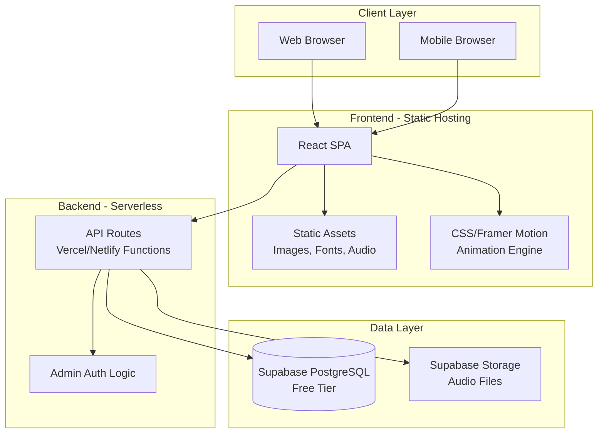
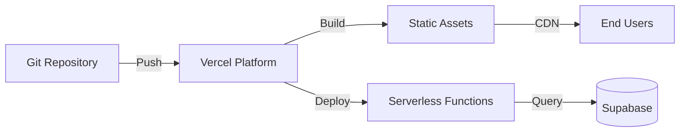
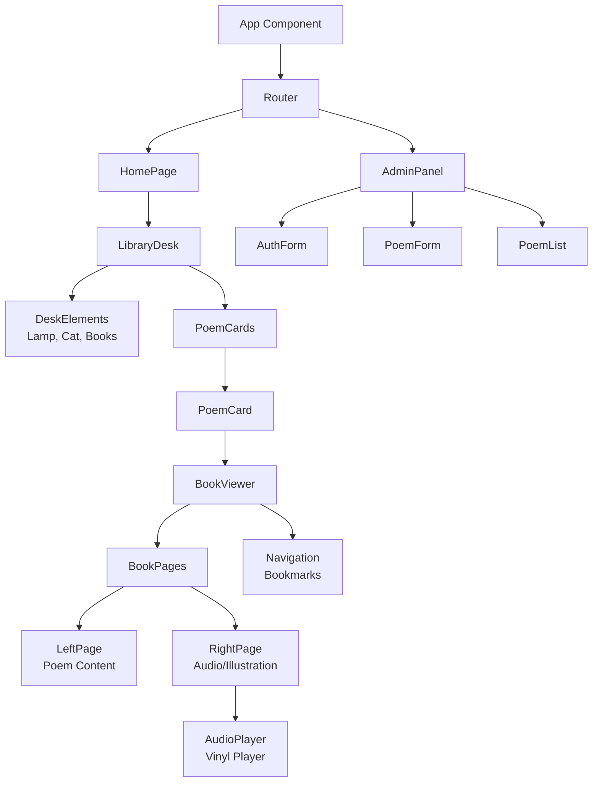
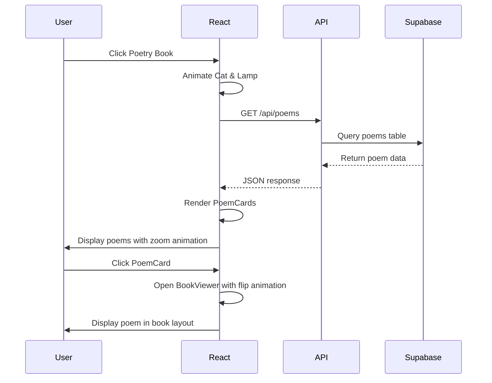
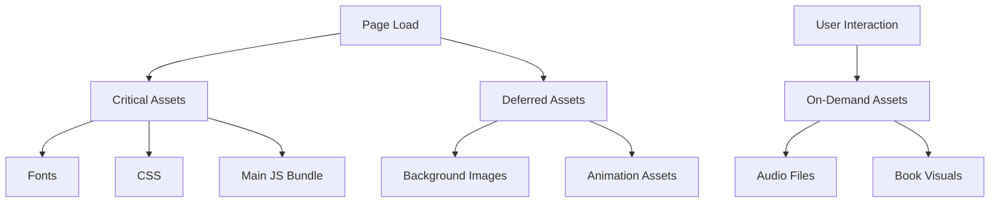

# Design Document: Artistic Poetry Platform

## Overview

The Artistic Poetry Platform is a web application that transforms poetry reading into an immersive experience within a vintage midnight library. The platform uses a static site architecture with serverless functions, optimized for free hosting on Vercel or Netlify, making it accessible for developers with no budget or container/server experience.

The system consists of three primary layers:
- **Frontend**: React-based single-page application with CSS animations and responsive design
- **Backend**: Serverless API functions for content management
- **Database**: Free-tier Supabase PostgreSQL for poem storage and metadata

The design prioritizes simplicity, performance, and aesthetic coherence while maintaining the vintage library atmosphere across all interactions.

## Architecture

### System Architecture Diagram



### Technology Stack

**Frontend:**
- React 18 with Vite (fast builds, beginner-friendly)
- Framer Motion for animations (declarative, simple API)
- CSS Modules for styling (scoped, no conflicts)
- React Router for navigation

**Backend:**
- Vercel Serverless Functions or Netlify Functions
- Node.js runtime (JavaScript throughout)

**Database:**
- Supabase (free tier: 500MB database, 1GB storage)
- PostgreSQL with REST API
- Row Level Security for admin protection

**Hosting:**
- Vercel (recommended) or Netlify
- Free tier: unlimited bandwidth, automatic HTTPS
- Git-based deployment (push to deploy)

**Asset Management:**
- Supabase Storage for audio files
- Optimized images served from static hosting
- WebP format with PNG fallbacks

### Deployment Architecture



**Deployment Flow:**
1. Developer pushes code to GitHub repository
2. Vercel automatically detects changes and triggers build
3. Vite builds React app into static files
4. Serverless functions are deployed
5. Static assets distributed via CDN
6. Environment variables configured in Vercel dashboard

**Free Tier Limits:**
- Vercel: 100GB bandwidth/month, unlimited sites
- Supabase: 500MB database, 1GB file storage, 2GB bandwidth
- Sufficient for personal poetry platform with moderate traffic

## Components and Interfaces

### Component Architecture



### Core Components

#### 1. LibraryDesk Component
**Purpose**: Renders the homepage with vintage library atmosphere

**Props**: None (fetches poems internally)

**State**:
- `isLoading`: boolean
- `catAwake`: boolean
- `lampBright`: boolean
- `showPoems`: boolean

**Key Methods**:
- `handlePoetryBookClick()`: Triggers cat/lamp animations and loads poems
- `animateTransition()`: Executes zoom-in effect into book

**Styling**: Deep black background (#0a0a0a), grain texture overlay, scattered book positioning

#### 2. PoemCard Component
**Purpose**: Displays poem preview as aged parchment

**Props**:
```typescript
interface PoemCardProps {
  id: string;
  title: string;
  language: 'en' | 'hi';
  preview: string;
  onClick: (id: string) => void;
}
```

**Styling**: Torn edges (clip-path), foxing spots (radial gradients), ink stains, handwritten font for titles

#### 3. BookViewer Component
**Purpose**: Full-screen book display with page flip animation

**Props**:
```typescript
interface BookViewerProps {
  poemId: string;
  onClose: () => void;
}
```

**State**:
- `isOpen`: boolean
- `currentPage`: number
- `poem`: PoemData

**Animations**:
- Entry: 3D page flip using Framer Motion (rotateY: -180 to 0)
- Exit: Reverse flip
- Duration: 1500ms with easeInOut

#### 4. AudioPlayer Component
**Purpose**: Vinyl record player interface for audio playback

**Props**:
```typescript
interface AudioPlayerProps {
  audioUrl: string;
  poemTitle: string;
}
```

**State**:
- `isPlaying`: boolean
- `rotation`: number (0-360)

**Features**:
- HTML5 Audio API
- Vinyl rotation animation (CSS transform: rotate)
- Play/pause controls styled as vintage buttons

#### 5. AdminPanel Component
**Purpose**: Content management interface

**Props**: None

**State**:
- `isAuthenticated`: boolean
- `poems`: PoemData[]
- `formData`: PoemFormData

**Authentication**: Hardcoded credentials checked against environment variables

**API Calls**:
- `POST /api/poems`: Create new poem
- `GET /api/poems`: Fetch all poems
- `PUT /api/poems/:id`: Update poem
- `DELETE /api/poems/:id`: Delete poem

### API Interface Specifications

#### GET /api/poems
**Response**:
```json
{
  "poems": [
    {
      "id": "uuid",
      "title": "string",
      "content": "string",
      "language": "en" | "hi",
      "audioUrl": "string | null",
      "createdAt": "timestamp"
    }
  ]
}
```

#### POST /api/poems
**Request**:
```json
{
  "title": "string",
  "content": "string",
  "language": "en" | "hi",
  "audioFile": "base64 | null"
}
```

**Response**:
```json
{
  "success": true,
  "poemId": "uuid"
}
```

#### Authentication Middleware
**Headers**: `Authorization: Bearer <token>`

**Token Generation**: Simple JWT with hardcoded secret in environment variables

## Data Models

### Database Schema

```sql
-- Poems table
CREATE TABLE poems (
  id UUID PRIMARY KEY DEFAULT uuid_generate_v4(),
  title TEXT NOT NULL,
  content TEXT NOT NULL,
  language VARCHAR(2) NOT NULL CHECK (language IN ('en', 'hi')),
  audio_url TEXT,
  created_at TIMESTAMP WITH TIME ZONE DEFAULT NOW(),
  updated_at TIMESTAMP WITH TIME ZONE DEFAULT NOW()
);

-- Index for faster queries
CREATE INDEX idx_poems_created_at ON poems(created_at DESC);

-- Row Level Security (RLS) for admin protection
ALTER TABLE poems ENABLE ROW LEVEL SECURITY;

-- Public read access
CREATE POLICY "Public poems are viewable by everyone"
  ON poems FOR SELECT
  USING (true);

-- Admin write access (authenticated via API)
CREATE POLICY "Authenticated users can insert poems"
  ON poems FOR INSERT
  WITH CHECK (true);

CREATE POLICY "Authenticated users can update poems"
  ON poems FOR UPDATE
  USING (true);

CREATE POLICY "Authenticated users can delete poems"
  ON poems FOR DELETE
  USING (true);
```

### TypeScript Interfaces

```typescript
// Core poem data structure
interface Poem {
  id: string;
  title: string;
  content: string;
  language: 'en' | 'hi';
  audioUrl: string | null;
  createdAt: Date;
  updatedAt: Date;
}

// Form data for admin panel
interface PoemFormData {
  title: string;
  content: string;
  language: 'en' | 'hi';
  audioFile: File | null;
}

// API response types
interface ApiResponse<T> {
  success: boolean;
  data?: T;
  error?: string;
}

// Animation state
interface AnimationState {
  isAnimating: boolean;
  progress: number;
  type: 'pageFlip' | 'zoom' | 'unfold';
}
```

### Data Flow



## Animation System Design

### Animation Library Choice

**Framer Motion** is selected for its:
- Declarative API (easy for beginners)
- Built-in gesture support (drag, tap, hover)
- Spring physics for natural motion
- Performance optimization (GPU acceleration)

### Key Animations

#### 1. Page Flip Animation
```typescript
const pageFlipVariants = {
  closed: {
    rotateY: -180,
    opacity: 0,
    transition: { duration: 0 }
  },
  open: {
    rotateY: 0,
    opacity: 1,
    transition: {
      duration: 1.5,
      ease: "easeInOut"
    }
  }
};
```

#### 2. Cat Wake-Up Sequence
```typescript
const catAnimationSequence = [
  { scale: 1, rotate: 0 },           // Sleeping
  { scale: 1.1, rotate: -5 },        // Stretch
  { scale: 1, rotate: 0 },           // Stand
  { y: -20, rotate: 10 },            // Jump 1
  { y: 0, rotate: -10 },             // Land
  { y: -15, x: 30, rotate: 5 },      // Jump 2
  { y: 0, x: 0, rotate: 0 }          // Final position
];
```

#### 3. Zoom Into Book
```typescript
const zoomVariants = {
  initial: { scale: 1, z: 0 },
  zoomed: {
    scale: 3,
    z: 100,
    transition: {
      duration: 1.5,
      ease: [0.43, 0.13, 0.23, 0.96]
    }
  }
};
```

#### 4. Floating Dust Particles
```typescript
// CSS animation for performance
@keyframes float {
  0%, 100% { transform: translateY(0) translateX(0); opacity: 0.3; }
  50% { transform: translateY(-20px) translateX(10px); opacity: 0.6; }
}

.dust-particle {
  animation: float 4s ease-in-out infinite;
  animation-delay: calc(var(--particle-index) * 0.3s);
}
```

### Performance Optimization

- Use `will-change: transform` for animated elements
- Limit simultaneous animations to 3-4 elements
- Use CSS animations for simple loops (dust particles)
- Use Framer Motion for complex interactions (page flips)
- Lazy load animation assets
- Reduce animation complexity on mobile (30fps target)

## Asset Management Strategy

### Asset Types and Optimization

#### 1. Images
**Formats**:
- WebP for modern browsers (60-80% smaller)
- PNG fallback for older browsers
- SVG for icons and simple graphics

**Optimization**:
- Compress images to 80% quality
- Resize to maximum needed dimensions
- Use responsive images with srcset
- Lazy load below-the-fold images

**Storage**:
- Static images: `/public/assets/images/`
- Served directly from Vercel CDN

#### 2. Fonts
**Required Fonts**:
- Playfair Display (English poetry)
- Cormorant Garamond (English poetry alternative)
- Noto Serif Devanagari (Hindi poetry)
- Inter (UI text)

**Loading Strategy**:
- Use Google Fonts with `font-display: swap`
- Preload critical fonts in HTML head
- Subset fonts to include only needed characters
- Use variable fonts where available

**Implementation**:
```html
<link rel="preconnect" href="https://fonts.googleapis.com">
<link rel="preload" as="style" href="https://fonts.googleapis.com/css2?family=Playfair+Display&family=Noto+Serif+Devanagari&family=Inter&display=swap">
```

#### 3. Audio Files
**Format**: MP3 (universal browser support)

**Optimization**:
- Compress to 128kbps (sufficient for voice)
- Normalize audio levels
- Trim silence from start/end

**Storage**:
- Supabase Storage bucket: `poem-audio`
- Public access with signed URLs
- Maximum file size: 5MB per poem

**Upload Flow**:
1. Admin uploads audio via form
2. API validates file type and size
3. File uploaded to Supabase Storage
4. URL stored in poems table
5. Audio streamed on demand (not preloaded)

#### 4. Textures and Effects
**Grain Texture**: Single PNG overlay (100x100px, tiled)
**Parchment Texture**: CSS gradients + noise filter
**Ink Stains**: SVG shapes with blur filters

**Implementation**:
```css
.parchment {
  background: linear-gradient(135deg, #f4e8d0 0%, #e8d5b7 100%);
  filter: url(#paper-grain);
}
```

### Asset Loading Strategy



**Priority Levels**:
1. **Critical** (blocking): Fonts, CSS, main JS
2. **High** (preload): Homepage background, desk elements
3. **Medium** (lazy): Poem card images, animations
4. **Low** (on-demand): Audio files, admin panel assets

## Mobile-Responsive Design Approach

### Breakpoint Strategy

```css
/* Mobile First Approach */
:root {
  --mobile: 0px;
  --tablet: 768px;
  --desktop: 1024px;
  --wide: 1440px;
}
```

### Layout Adaptations

#### Desktop (>1024px)
- Full library desk view
- Scattered poem cards (CSS Grid with random positioning)
- Horizontal book opening
- Hover effects enabled

#### Tablet (768px - 1024px)
- Simplified desk view
- Grid layout for poem cards (2 columns)
- Horizontal book opening (scaled down)
- Touch-optimized targets (44px minimum)

#### Mobile (<768px)
- Crumpled paper background (no desk)
- Vertical list of poem cards
- Full-screen book viewer
- Vertical page flip animation
- Swipe gestures for page navigation

### Touch Interaction Patterns

```typescript
// Framer Motion gesture handlers
<motion.div
  drag="x"
  dragConstraints={{ left: 0, right: 0 }}
  onDragEnd={(e, { offset, velocity }) => {
    if (offset.x > 100) {
      // Swipe right - previous page
      navigatePage('prev');
    } else if (offset.x < -100) {
      // Swipe left - next page
      navigatePage('next');
    }
  }}
>
```

### Responsive Typography

```css
/* Fluid typography using clamp */
.poem-text {
  font-size: clamp(16px, 2.5vw, 24px);
  line-height: 1.8;
}

.poem-title {
  font-size: clamp(24px, 4vw, 48px);
  line-height: 1.2;
}
```

### Performance Considerations for Mobile

- Reduce animation complexity (simpler easing)
- Lower frame rate target (30fps vs 60fps)
- Smaller image assets for mobile viewports
- Disable particle effects on low-end devices
- Use CSS transforms instead of position changes
- Implement intersection observer for lazy loading

### Mobile-Specific Features

**Crumpled Paper Aesthetic**:
```css
.mobile-background {
  background: 
    url('/assets/crumpled-paper.webp'),
    linear-gradient(135deg, #2a2a2a 0%, #1a1a1a 100%);
  background-blend-mode: multiply;
}
```

**Vertical Page Flip**:
- Rotate along X-axis instead of Y-axis
- Shorter duration (1000ms vs 1500ms)
- Simplified shadow effects

**Touch Feedback**:
```css
.poem-card:active {
  transform: scale(0.98);
  transition: transform 100ms;
}
```

## Error Handling

### Error Categories and Strategies

#### 1. Network Errors
**Scenarios**: API timeout, connection loss, Supabase unavailable

**Handling**:
- Display user-friendly message: "The library is temporarily closed. Please try again."
- Retry logic with exponential backoff (3 attempts)
- Cache last successful poem data in localStorage
- Graceful degradation: show cached poems if available

**Implementation**:
```typescript
async function fetchPoems(retries = 3): Promise<Poem[]> {
  try {
    const response = await fetch('/api/poems');
    if (!response.ok) throw new Error('Network error');
    return await response.json();
  } catch (error) {
    if (retries > 0) {
      await delay(1000 * (4 - retries)); // Exponential backoff
      return fetchPoems(retries - 1);
    }
    // Fallback to cached data
    return getCachedPoems();
  }
}
```

#### 2. Authentication Errors
**Scenarios**: Invalid admin credentials, expired session

**Handling**:
- Clear error message: "Invalid credentials. Please check username and password."
- Rate limiting: 5 attempts per 15 minutes
- No password hints (security)
- Session timeout after 1 hour of inactivity

#### 3. Content Parsing Errors
**Scenarios**: Invalid Unicode, malformed text, unsupported characters

**Handling**:
- Validate input before submission
- Display specific error: "Hindi text contains invalid characters"
- Preview before publishing
- Sanitize input to prevent XSS

**Validation**:
```typescript
function validatePoemContent(content: string, language: string): ValidationResult {
  if (!content.trim()) {
    return { valid: false, error: 'Poem content cannot be empty' };
  }
  
  if (language === 'hi') {
    // Check for Devanagari script
    const devanagariRegex = /[\u0900-\u097F]/;
    if (!devanagariRegex.test(content)) {
      return { valid: false, error: 'Hindi poems must contain Devanagari script' };
    }
  }
  
  return { valid: true };
}
```

#### 4. Audio Playback Errors
**Scenarios**: File not found, unsupported format, loading failure

**Handling**:
- Hide audio player if file unavailable
- Display message: "Audio narration unavailable for this poem"
- Log error for admin review
- Continue showing text content

#### 5. Animation Performance Errors
**Scenarios**: Low-end device, browser compatibility

**Handling**:
- Detect device capabilities on load
- Disable complex animations on low-end devices
- Fallback to simple transitions
- Maintain functionality without animations

**Detection**:
```typescript
function detectPerformanceCapability(): 'high' | 'medium' | 'low' {
  const memory = (navigator as any).deviceMemory;
  const cores = navigator.hardwareConcurrency;
  
  if (memory >= 4 && cores >= 4) return 'high';
  if (memory >= 2 && cores >= 2) return 'medium';
  return 'low';
}
```

### Error Logging

**Client-Side**:
- Console errors in development
- Silent errors in production (no user-facing console logs)
- Optional: Sentry integration for error tracking (free tier)

**Server-Side**:
- Vercel function logs (automatic)
- Structured logging with context
- No sensitive data in logs

## Testing Strategy

### Dual Testing Approach

The testing strategy combines unit tests for specific scenarios and property-based tests for universal correctness guarantees. Unit tests validate concrete examples, edge cases, and integration points, while property-based tests verify that system behaviors hold across all possible inputs.

### Unit Testing

**Framework**: Vitest (fast, Vite-native, Jest-compatible API)

**Coverage Areas**:
- Component rendering and interactions
- API endpoint responses
- Data parsing and validation
- Animation state transitions
- Error handling scenarios

**Example Unit Tests**:
```typescript
describe('PoemCard Component', () => {
  it('renders poem title and preview', () => {
    const poem = { id: '1', title: 'Test Poem', preview: 'First line...' };
    render(<PoemCard {...poem} />);
    expect(screen.getByText('Test Poem')).toBeInTheDocument();
  });
  
  it('applies Hindi font for Hindi poems', () => {
    const poem = { id: '1', title: 'हिंदी कविता', language: 'hi' };
    render(<PoemCard {...poem} />);
    const card = screen.getByTestId('poem-card');
    expect(card).toHaveStyle({ fontFamily: /Noto Serif Devanagari/ });
  });
});
```

**Integration Tests**:
- Admin authentication flow
- Poem upload and display pipeline
- Audio player with actual audio files
- Navigation between views

### Property-Based Testing

**Framework**: fast-check (JavaScript property-based testing library)

**Configuration**: Minimum 100 iterations per property test to ensure comprehensive input coverage through randomization.

**Test Tagging**: Each property test must include a comment referencing the design document property:
```typescript
// Feature: artistic-poetry-platform, Property 1: [property text]
```


## Correctness Properties

*A property is a characteristic or behavior that should hold true across all valid executions of a system—essentially, a formal statement about what the system should do. Properties serve as the bridge between human-readable specifications and machine-verifiable correctness guarantees.*

### Property Reflection

After analyzing all acceptance criteria, I identified the following redundancies:
- Properties 4.1 and 10.2 both test English font rendering (consolidated into Property 1)
- Properties 4.2 and 10.3 both test Hindi font rendering (consolidated into Property 2)
- Multiple properties test font application across different contexts (consolidated into Properties 1-3)
- Animation duration limits can be tested as a single comprehensive property (Property 4)

The following properties represent unique, non-redundant correctness guarantees:

### Property 1: English Poetry Font Consistency

*For any* poem with language set to English, the rendered text SHALL use either Playfair Display or Cormorant Garamond font family.

**Validates: Requirements 4.1, 10.2**

### Property 2: Hindi Poetry Font Consistency

*For any* poem with language set to Hindi, the rendered text SHALL use Noto Serif Devanagari font family.

**Validates: Requirements 4.2, 10.3**

### Property 3: UI Text Font Consistency

*For any* UI text element (navigation, buttons, labels), the rendered text SHALL use Inter font family.

**Validates: Requirements 4.3**

### Property 4: Animation Duration Bounds

*For any* animation triggered by user interaction or system event, the animation duration SHALL not exceed 2000ms.

**Validates: Requirements 7.5**

### Property 5: Audio Playback Synchronization

*For any* audio playback state change (play, pause, stop), the vinyl disc rotation animation SHALL synchronize with the playback state (rotating when playing, stopped when paused or stopped).

**Validates: Requirements 5.6**

### Property 6: Navigation Bookmark Functionality

*For any* navigation bookmark element, clicking it SHALL navigate to its corresponding section (home, browse, or settings).

**Validates: Requirements 6.4**

### Property 7: Mobile Swipe Direction Mapping

*For any* swipe gesture on mobile book viewer, the page turn direction SHALL match the swipe direction (swipe left = next page, swipe right = previous page).

**Validates: Requirements 8.6**

### Property 8: Multilingual Text Input Acceptance

*For any* valid English or Hindi text input in the admin panel, the form SHALL accept and process the input without rejection.

**Validates: Requirements 9.3**

### Property 9: Language Metadata Persistence

*For any* poem created through the admin panel, the language metadata SHALL be stored in the database and retrievable with the poem data.

**Validates: Requirements 10.1**

### Property 10: Text Direction Correctness

*For any* poem rendered in English or Hindi, the text direction SHALL be left-to-right with proper alignment.

**Validates: Requirements 10.4**

### Property 11: Unicode Devanagari Support

*For any* Hindi poem containing Devanagari Unicode characters (U+0900 to U+097F), the platform SHALL render the characters correctly without corruption or replacement.

**Validates: Requirements 10.5**

### Property 12: Native Language Title Display

*For any* poem, the manuscript title SHALL be displayed in the poem's specified language (English titles for English poems, Hindi titles for Hindi poems).

**Validates: Requirements 10.7**

### Property 13: Interaction Response Time

*For any* user interaction (click, tap, hover), the platform SHALL respond with visual feedback or state change within 100ms.

**Validates: Requirements 11.4**

### Property 14: Keyboard Accessibility

*For any* interactive element (buttons, cards, bookmarks), the element SHALL be accessible and operable via keyboard navigation (Tab, Enter, Space).

**Validates: Requirements 11.7**

### Property 15: Line Break Preservation

*For any* poem content containing line breaks and stanza separations, parsing and rendering SHALL preserve the original line break structure.

**Validates: Requirements 12.1**

### Property 16: Indentation Preservation

*For any* poem content containing indentation (spaces or tabs at line start), parsing and rendering SHALL preserve the original indentation.

**Validates: Requirements 12.2**

### Property 17: Content Encoding Validation

*For any* uploaded poem content, the validation process SHALL verify proper UTF-8 encoding and reject invalid byte sequences with a descriptive error message.

**Validates: Requirements 12.3**

### Property 18: Parse Error Messaging

*For any* poem upload that fails content parsing, the admin panel SHALL return a descriptive error message indicating the specific parsing failure.

**Validates: Requirements 12.4**

### Property 19: Layout Template Application

*For any* successfully parsed poem, the platform SHALL format the content into the book layout template with left page content and right page audio/illustration area.

**Validates: Requirements 12.5**

### Property 20: Preview-Render Consistency (Round Trip)

*For any* valid poem upload, the preview rendering SHALL be identical to the final published rendering (round-trip property).

**Validates: Requirements 12.6**

### Property 21: Special Character Support

*For any* poem content containing special characters (punctuation, symbols, diacritics) in English or Hindi, the platform SHALL parse, store, and render the characters correctly without loss or corruption.

**Validates: Requirements 12.7**

### Property 22: Poem Content Font Size Bounds

*For any* poem content rendered in the book viewer, the font size SHALL be between 16px and 24px inclusive.

**Validates: Requirements 4.7**

### Property 23: Book Aspect Ratio Consistency

*For any* viewport breakpoint (mobile, tablet, desktop), the book visual SHALL maintain its aspect ratio without distortion.

**Validates: Requirements 14.5**

### Property 24: Proportional Font Scaling

*For any* viewport breakpoint change, font sizes SHALL scale proportionally to maintain readability (larger fonts for larger viewports, smaller fonts for smaller viewports).

**Validates: Requirements 14.6**

### Property 25: Mobile Touch Target Minimum Size

*For any* interactive element on mobile devices (viewport < 768px), the touch target size SHALL be at least 44px in both width and height.

**Validates: Requirements 14.7**

## Testing Strategy

### Dual Testing Approach

The platform requires both unit tests and property-based tests for comprehensive correctness validation. Unit tests verify specific examples, edge cases, and integration points, while property-based tests verify universal properties across all possible inputs.

### Unit Testing Strategy

**Framework**: Vitest with React Testing Library

**Coverage Areas**:
1. **Component Rendering**: Verify specific UI elements render correctly
2. **User Interactions**: Test click, hover, swipe handlers
3. **Animation Triggers**: Verify animations start on correct events
4. **API Integration**: Test API calls and response handling
5. **Error Scenarios**: Test error states and messages
6. **Edge Cases**: Empty states, missing data, network failures

**Example Unit Tests**:

```typescript
// Component rendering example
describe('LibraryDesk Component', () => {
  it('renders Poetry book and Journal book on load', () => {
    render(<LibraryDesk />);
    expect(screen.getByText('Poetry')).toBeInTheDocument();
    expect(screen.getByText('Journal')).toBeInTheDocument();
  });
  
  it('triggers cat wake animation when Poetry book is clicked', async () => {
    render(<LibraryDesk />);
    const poetryBook = screen.getByText('Poetry');
    fireEvent.click(poetryBook);
    
    const cat = screen.getByTestId('cat-element');
    await waitFor(() => {
      expect(cat).toHaveClass('awake');
    });
  });
});

// API integration example
describe('Poem API', () => {
  it('creates new poem and returns ID', async () => {
    const poemData = {
      title: 'Test Poem',
      content: 'Line 1\nLine 2',
      language: 'en'
    };
    
    const response = await fetch('/api/poems', {
      method: 'POST',
      body: JSON.stringify(poemData)
    });
    
    const result = await response.json();
    expect(result.success).toBe(true);
    expect(result.poemId).toBeDefined();
  });
});

// Error handling example
describe('Content Parsing', () => {
  it('returns error for invalid UTF-8 encoding', () => {
    const invalidContent = Buffer.from([0xFF, 0xFE, 0xFD]);
    const result = validatePoemContent(invalidContent.toString(), 'en');
    
    expect(result.valid).toBe(false);
    expect(result.error).toContain('encoding');
  });
});
```

**Unit Test Guidelines**:
- Focus on specific examples and concrete scenarios
- Test integration between components
- Verify error handling and edge cases
- Keep tests simple and readable
- Avoid testing implementation details

### Property-Based Testing Strategy

**Framework**: fast-check (JavaScript property-based testing library)

**Configuration**:
- Minimum 100 iterations per property test
- Custom generators for domain-specific data (poems, languages, viewport sizes)
- Shrinking enabled for minimal failing examples

**Test Tagging Convention**:
Every property test MUST include a comment referencing the design property:
```typescript
// Feature: artistic-poetry-platform, Property 1: English Poetry Font Consistency
```

**Property Test Examples**:

```typescript
import fc from 'fast-check';

// Property 1: English Poetry Font Consistency
// Feature: artistic-poetry-platform, Property 1: English Poetry Font Consistency
test('English poems always use Playfair Display or Cormorant Garamond', () => {
  fc.assert(
    fc.property(
      fc.record({
        id: fc.uuid(),
        title: fc.string({ minLength: 1, maxLength: 100 }),
        content: fc.string({ minLength: 10, maxLength: 5000 }),
        language: fc.constant('en')
      }),
      (poem) => {
        const rendered = renderPoem(poem);
        const fontFamily = getComputedStyle(rendered).fontFamily;
        
        return fontFamily.includes('Playfair Display') || 
               fontFamily.includes('Cormorant Garamond');
      }
    ),
    { numRuns: 100 }
  );
});

// Property 15: Line Break Preservation
// Feature: artistic-poetry-platform, Property 15: Line Break Preservation
test('Poem parsing preserves line breaks', () => {
  fc.assert(
    fc.property(
      fc.array(fc.string({ minLength: 1, maxLength: 100 }), { minLength: 1, maxLength: 50 }),
      (lines) => {
        const originalContent = lines.join('\n');
        const parsed = parsePoem(originalContent);
        const rendered = renderParsedPoem(parsed);
        
        // Count line breaks in original and rendered
        const originalBreaks = (originalContent.match(/\n/g) || []).length;
        const renderedBreaks = (rendered.match(/<br>|<\/p>/g) || []).length;
        
        return originalBreaks === renderedBreaks;
      }
    ),
    { numRuns: 100 }
  );
});

// Property 20: Preview-Render Consistency (Round Trip)
// Feature: artistic-poetry-platform, Property 20: Preview-Render Consistency
test('Preview rendering matches final rendering', () => {
  fc.assert(
    fc.property(
      fc.record({
        title: fc.string({ minLength: 1, maxLength: 100 }),
        content: fc.string({ minLength: 10, maxLength: 5000 }),
        language: fc.constantFrom('en', 'hi')
      }),
      (poemData) => {
        const preview = renderPreview(poemData);
        const final = renderFinal(poemData);
        
        // Compare rendered HTML structure (ignoring IDs and timestamps)
        const normalizedPreview = normalizeHTML(preview);
        const normalizedFinal = normalizeHTML(final);
        
        return normalizedPreview === normalizedFinal;
      }
    ),
    { numRuns: 100 }
  );
});

// Property 25: Mobile Touch Target Minimum Size
// Feature: artistic-poetry-platform, Property 25: Mobile Touch Target Minimum Size
test('All interactive elements on mobile have 44px minimum touch target', () => {
  fc.assert(
    fc.property(
      fc.constantFrom('button', 'poem-card', 'bookmark', 'audio-control'),
      (elementType) => {
        // Set mobile viewport
        setViewportSize(375, 667);
        
        const element = renderInteractiveElement(elementType);
        const rect = element.getBoundingClientRect();
        
        return rect.width >= 44 && rect.height >= 44;
      }
    ),
    { numRuns: 100 }
  );
});

// Property 11: Unicode Devanagari Support
// Feature: artistic-poetry-platform, Property 11: Unicode Devanagari Support
test('Hindi poems with Devanagari characters render correctly', () => {
  fc.assert(
    fc.property(
      fc.string({ minLength: 10, maxLength: 1000 })
        .map(s => s.replace(/./g, () => 
          String.fromCharCode(0x0900 + Math.floor(Math.random() * 128))
        )),
      (devanagariText) => {
        const poem = { title: 'Test', content: devanagariText, language: 'hi' };
        const rendered = renderPoem(poem);
        const renderedText = rendered.textContent;
        
        // Verify no replacement characters (�)
        return !renderedText.includes('�') && 
               renderedText.length === devanagariText.length;
      }
    ),
    { numRuns: 100 }
  );
});
```

**Custom Generators**:

```typescript
// Generator for valid poems
const poemGenerator = fc.record({
  id: fc.uuid(),
  title: fc.string({ minLength: 1, maxLength: 100 }),
  content: fc.array(
    fc.string({ minLength: 1, maxLength: 100 }),
    { minLength: 1, maxLength: 50 }
  ).map(lines => lines.join('\n')),
  language: fc.constantFrom('en', 'hi'),
  audioUrl: fc.option(fc.webUrl(), { nil: null })
});

// Generator for viewport sizes
const viewportGenerator = fc.record({
  width: fc.integer({ min: 320, max: 2560 }),
  height: fc.integer({ min: 568, max: 1440 })
});

// Generator for Hindi Devanagari text
const devanagariGenerator = fc.array(
  fc.integer({ min: 0x0900, max: 0x097F }).map(code => String.fromCharCode(code)),
  { minLength: 10, maxLength: 1000 }
).map(chars => chars.join(''));
```

**Property Test Guidelines**:
- Each property test validates one correctness property
- Use domain-specific generators for realistic test data
- Verify universal properties that hold for all inputs
- Let the library find edge cases through randomization
- Tag each test with its corresponding design property

### Integration Testing

**Scope**: End-to-end user flows

**Key Flows**:
1. Homepage load → Click Poetry book → View poems → Open book → Play audio
2. Admin login → Upload poem → Preview → Publish → Verify on homepage
3. Mobile: Load homepage → Tap poem → Swipe pages → Close book

**Tools**: Playwright or Cypress for browser automation

### Performance Testing

**Metrics**:
- Animation frame rate (target: 60fps desktop, 30fps mobile)
- Time to Interactive (target: <3s)
- Largest Contentful Paint (target: <2.5s)
- Book opening latency (target: <500ms)

**Tools**: Lighthouse CI in deployment pipeline

### Test Coverage Goals

- Unit test coverage: >80% for business logic
- Property test coverage: 100% of correctness properties
- Integration test coverage: All critical user flows
- Visual regression: Key UI states (homepage, book viewer, mobile)

### Continuous Integration

**Pipeline**:
1. Run unit tests on every commit
2. Run property tests on every commit
3. Run integration tests on pull requests
4. Run performance tests on main branch
5. Deploy to preview environment for manual testing

**Tools**: GitHub Actions with Vercel preview deployments

